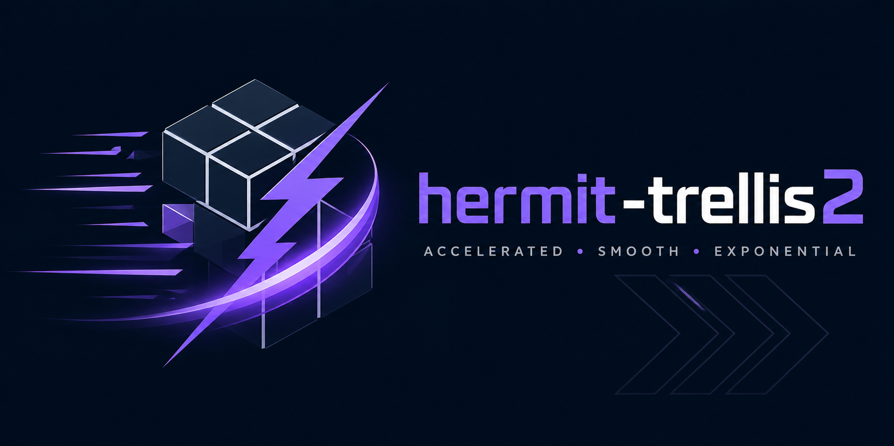

<div align="center">



# 🧭 hermit-trellis2

**Training-free Hermite-cached acceleration for [TRELLIS.2-4B](https://github.com/microsoft/TRELLIS) image-to-3D — ~1.9× fewer network evaluations, lossless, one line of code.**

`TRELLIS.2-4B` · `1024_cascade` (mesh + texture) · training-free · single RTX 5090 · MIT

</div>

> **HiCache++ variant:** an exponential (DMD/Prony) forecast variant of this repo lives in [`hermit-trellis2-plus-plus`](https://github.com/Archerkattri/hermit-trellis2-plus-plus) — same carved-hybrid, with the sparse-structure velocity forecast on a Dynamic-Mode-Decomposition basis instead of the Hermite polynomial.

## When to use this repo

These repos are **complementary accelerators, not competing solutions** — each speeds up a *different*
base generator, and the `+` / `++` suffix is a **method choice**, not a rival product. Pick by
**(1) which base model you run**, then **(2) which forecast basis you want**:

| base generator | `+` = HiCache (Hermite) | `++` = HiCache++ (DMD) |
|---|---|---|
| Hunyuan3D-2.1 | `hunyuan2.1-plus` | `hunyuan2.1-plus-plus` |
| Hunyuan3D-2 mini | `hunyuan2-plus` | `hunyuan2-plus-plus` |
| SAM 3D Objects | `sam3d-plus` | `sam3d-plus-plus` |
| Fast-SAM3D | `fastsam3d-plus` | `fastsam3d-plus-plus` |
| DiT-XL/2 (ImageNet) | `dit-plus` | `dit-plus-plus` |
| TRELLIS (v1) | `faster-trellis` | `faster-trellis-plus-plus` |
| TRELLIS.2-4B (v2) | `hermit-trellis2` | `hermit-trellis2-plus-plus` |

- **`+` (HiCache / scaled-Hermite):** the *published* polynomial velocity-forecast basis — conservative, reproduces the HiCache paper. Use it to deploy the established method.
- **`++` (HiCache++ / DMD exponential):** our Dynamic-Mode-Decomposition basis — *the same near-lossless quality at wider skip intervals*, where the polynomial diverges. Use it when you push the cache interval for more speed.
- **standalone / model-agnostic:** [`hicache-plus-plus`](https://github.com/Archerkattri/hicache-plus-plus) — the forecaster itself, to add DMD caching to *your own* diffusion/flow model.
- **`fast-trellis2`** = the TaylorSeer baseline fork (the upstream "Fast" accel) — the v2 reference point, not a HiCache variant.

> **This repo:** `hermit-trellis2` — **TRELLIS.2-4B × HiCache (Hermite)** — carved-hybrid on the 4B v2 model.

`hermit-trellis2` is `TRELLIS.2-4B` image-to-3D with a **training-free Hermite carved-hybrid** built
into the flow-matching sampler. It forecasts the model's **final CFG-combined velocity** with a
dual-scaled **Hermite** basis on the sparse-structure stage and **carves** the structured-latent
tokens — so the sampler spends far fewer network evaluations per asset, with the weights, decoders,
and the full `1024_cascade` mesh + texture left untouched. *(The name is a nod to the **Hermite**
forecast at its core — and yes, it's happy running on its own.)*

```python
pipe.enable_faster()        # the Hermite carved-hybrid — one line, lossless vs the base model
pipe.enable_faster("base")  # stock TRELLIS.2 sampler (kill-switch)
```

**What it does.** Two accelerations act on the velocity the samplers emit, one per stage class:

- **Hermite (HiCache)** on the **sparse-structure** stage — a dual-scaled physicist's-Hermite
  forecast of the velocity that skips network calls fixing the coarse occupancy volume, while always
  computing the early steps where topology is decided.
- **Token-carved SLaT** on the **structured-latent** stages — a learned-cadence temporal skip plus
  spatial **token carving** that recomputes only the high-frequency voxels each step.

**Where it sits.** `hermit-trellis2` is the **v2 instance of the Hermite carved-hybrid** — the same
method that on TRELLIS v1 **beats Fast-TRELLIS on both speed and quality** (sibling repo
[faster-trellis](https://github.com/Archerkattri/faster-trellis)). On TRELLIS.2 it is a **~1.9×
lossless accelerator of the base model**; the alternative TaylorSeer port,
[fast-trellis2](https://github.com/Archerkattri/fast-trellis2), reaches comparable speed and is a
touch ahead on the v2 mesh F-score below — TRELLIS.2's fast baseline is already strong, leaving the
two **on par on v2**. The Hermite forecast's distinction is that it **stays accurate at long skip
horizons where the monomial TaylorSeer basis diverges**. It ships as a single, lossless-target
configuration — no mode menu.

See [Results](#results). `GF_CARVE_RATIO` / `GF_HICACHE_SS_INTERVAL` / `GF_HICACHE_FIRST_ENHANCE`
override the defaults for tuning.

---

## Quickstart

```bash
git clone https://github.com/Archerkattri/hermit-trellis2
cd hermit-trellis2
# TRELLIS.2 runtime deps (torch, flash-attn, spconv/flex_gemm, o-voxel, cumesh,
# nvdiffrast) per microsoft/TRELLIS.2. Place / symlink weights at ckpts/TRELLIS.2-4B.
```

```python
from trellis2.pipelines import Trellis2ImageTo3DPipeline
from PIL import Image

pipe = Trellis2ImageTo3DPipeline.from_pretrained("ckpts/TRELLIS.2-4B").to("cuda")
pipe.enable_faster()                                  # ← the only added line

out  = pipe.run(Image.open("input_rgba.png"), pipeline_type="1024_cascade")
mesh = out[0]
```

`example_faster.py` is the runnable end-to-end script; `example.py` is the stock TRELLIS.2 demo.

<details>
<summary><b>RTX 50-series (sm_120) launch env</b></summary>

`1024_cascade` fits in 32 GB with `expandable_segments`:

```bash
SPARSE_CONV_BACKEND=spconv SPCONV_ALGO=native ATTN_BACKEND=flash_attn \
PYTORCH_CUDA_ALLOC_CONF=expandable_segments:True CUDA_VISIBLE_DEVICES=0 \
  python example_faster.py --image input_rgba.png
```

`SPCONV_ALGO=native` is recommended on newer GPU architectures.
</details>

---

## Results

40 Toys4K objects, **RTX 5090**, TRELLIS.2-4B, full `1024_cascade` (mesh + texture), seed 42.
Geometry is scored on the o-voxel mesh decoder with area-weighted surface sampling, after a
globally-optimal (Go-ICP) similarity alignment to the ground-truth mesh — the same harness across
rows, over the **35 objects all three completed**. Latency is end-to-end generation, weights resident.

| | F1@0.05 mean ↑ | F1 median ↑ | CD ↓ | latency ↓ | speedup |
|---|:--:|:--:|:--:|:--:|:--:|
| TRELLIS.2 (base) | 0.860 | 0.932 | 0.057 | 11.75 s | 1.00× |
| fast-trellis2 (TaylorSeer) | 0.900 | 0.959 | 0.048 | 6.23 s | 1.89× |
| **hermit-trellis2 (Hermite)** | 0.869 | 0.957 | 0.059 | 6.26 s | 1.88× |

<sub>CD ↓ lower is better; F1 ↑ higher is better. **hermit-trellis2 accelerates the base model
~1.9× at near-lossless quality** (F1 mean 0.869 vs 0.860; CD within run-to-run noise). On this v2
mesh F-score the TaylorSeer sibling [fast-trellis2](https://github.com/Archerkattri/fast-trellis2)
is a touch ahead — TRELLIS.2's strong fast baseline leaves little headroom — so the two are best
read as **on par on v2**. The Hermite forecast's decisive advantage shows on **v1**
([faster-trellis](https://github.com/Archerkattri/faster-trellis): 1.35× faster *and* higher
F-score than Fast-TRELLIS) and in its long-horizon stability, where TaylorSeer's monomials diverge.</sub>

---

## How it works

TRELLIS.2 samples a shape in three flow-matching stages — **sparse structure (SS)**, **shape
SLaT** (the 512→1024 cascade), and **texture SLaT** (guidance = 1, no CFG) — each a short Euler
sampler. Both accelerators act on the final velocity `pred_v` those samplers emit.

<details>
<summary><b>① Hermite (HiCache) velocity forecast</b> (replaces network calls on skipped steps)</summary>

At a **compute** step the sampler runs the model, caches `F_t = pred_v`, and keeps backward
finite differences:

```
Δ⁰F_t = F_t
ΔⁱF_t = (Δⁱ⁻¹F_t − Δⁱ⁻¹F_{t−N}) / N
```

At a **skipped** step (`k` past the last compute step) it forecasts the velocity with the
dual-scaled physicist's Hermite basis instead of touching the network:

```
F̂_{t−k} = F_t + Σ_{i≥1} (ΔⁱF_t / i!) · H̃_i(−k)
H̃_n(x) = σⁿ · H_n(σ·x),   σ ∈ (0,1)
H_0 = 1,  H_1 = 2x,  H_{n+1} = 2x·H_n − 2n·H_{n−1}
```

**Why Hermite over Taylor?** TaylorSeer is the special case `H̃_i(−k) = (−k)ⁱ`. Those
monomials blow up super-exponentially with order and horizon, so high-order terms dominate
and the forecast diverges. The dual σ-scaling (input scale `σx` **and** coefficient scale
`σⁿ`) contracts the basis into the bounded, oscillatory regime of the Hermite functions, so
the forecast tracks the true velocity on the same cached anchors without diverging. For the
dense SS latent `pred_v` is forecast directly; for the SLaT `SparseTensor`s only `.feats` is
forecast and coords carry through via `.replace(feats)`. *(arXiv:2508.16984)*
</details>

<details>
<summary><b>② Token-carved SLaT — recompute only the high-frequency voxels</b> (SLaT stages)</summary>

The SLaT stages denoise a `SparseTensor` of voxel tokens, and most tokens change slowly between
steps. On each computed step we score every token by **spatial high-frequency energy** (a 3D-FFT
of the sparse-structure occupancy grid) together with its velocity magnitude and frame-to-frame
motion, and recompute only the most active fraction; the smoothest tokens reuse their cached
velocity, under a staleness bound that forces a periodic full refresh so no token drifts. On top of
that a **learned-k delta cache** skips whole steps when the velocity field is locally linear
(`vₜ ≈ xₜ + Δ`). The SS occupancy's per-token frequency score is the same one the Hermite stage
reads, so the two stages share one signal. *(Fast-TRELLIS token selection, paired with our Hermite
SS forecast; carving level = `GF_CARVE_RATIO`.)*
</details>

<details>
<summary><b>③ Per-stage split</b> (Hermite on SS, token carving on SLaT)</summary>

The two accelerations are matched to what each stage costs. The **sparse-structure** stage is a
small dense volume that fixes the asset's topology — the Hermite forecast thins it while always
computing the first six steps (`GF_HICACHE_FIRST_ENHANCE`), so the occupancy can't be corrupted.
The **shape and texture SLaT** stages are the sparse, expensive ones — token carving recomputes only
their high-frequency voxels per step and the delta cache skips whole steps. The pipeline computes the
SS occupancy's 3D-FFT frequency score once and hands it to the SLaT sampler (`set_coords_scores`),
so the carving signal is the SS structure itself — wired in `trellis2/pipelines/trellis2_image_to_3d.py`.

**The savings multiply:** the SLaT sampler skips whole steps (delta cache) *and* carves tokens on
the steps it does run, while the Hermite forecast independently thins the SS stage.
</details>

---

## Tuning

One shipped configuration; each knob is overridable by env var (takes precedence) or directly on
the swapped sampler instances:

| knob | env | default | meaning |
|---|---|:--:|---|
| carving level | `GF_CARVE_RATIO` | `0.10` | fraction of SLaT tokens cached/skipped per step |
| SS interval | `GF_HICACHE_SS_INTERVAL` | `2` | sparse-structure: compute 1 step, forecast `interval − 1` |
| SS first-enhance | `GF_HICACHE_FIRST_ENHANCE` | `6` | always compute the first N SS steps (protects topology) |

```python
import os; os.environ["GF_CARVE_RATIO"] = "0.15"
pipe.enable_faster()
# …or set the instances directly, after enable_faster():
pipe.sparse_structure_sampler.hicache_interval = 2
pipe.shape_slat_sampler.carving_ratio = 0.10
```

---

## What's added on top of TRELLIS.2

All Microsoft TRELLIS.2 model / decoder / o-voxel code is unchanged. Added files only:

- `trellis2/pipelines/samplers/hicache.py` — Hermite basis + finite-difference cache
- `trellis2/pipelines/samplers/hicache_freq.py` — 3D-FFT high-frequency token scoring (the carving signal)
- `trellis2/pipelines/samplers/flow_euler_carved.py` — the token-carved SLaT sampler (delta-cache step-skip + carving)
- `trellis2/pipelines/samplers/flow_euler.py` — `HiCacheMixin` + the accelerated sampler classes
- `trellis2/pipelines/samplers/__init__.py` — registers the accelerated samplers
- `trellis2/pipelines/trellis2_image_to_3d.py` — `enable_faster()` (single config) + the per-stage wiring
- `example_faster.py`

The accelerators are independent re-implementations of the cited papers on the TRELLIS.2 sampler API.

---

## Credits & license

| | |
|---|---|
| **TRELLIS.2** | [microsoft/TRELLIS](https://github.com/microsoft/TRELLIS) — the pipeline, models, decoders this builds on (MIT) |
| **HiCache** | arXiv:2508.16984 — Hermite-polynomial velocity forecasting |
| **Fast-TRELLIS** | [wlfeng0509/Fast-SAM3D (Fast-TRELLIS branch)](https://github.com/wlfeng0509/Fast-SAM3D/tree/Fast-TRELLIS) — the token-carving substrate the SLaT stage builds on |

MIT. Accelerations © 2026 Krishi Attri; bundled TRELLIS.2 © Microsoft Corporation. See
[`LICENSE`](LICENSE) and [`NOTICE`](NOTICE).

**Krishi Attri** · krishiattriwork@gmail.com · [github.com/Archerkattri](https://github.com/Archerkattri)

<details>
<summary><b>BibTeX</b></summary>

```bibtex
@software{attri2026hermittrellis2,
  author = {Krishi Attri},
  title  = {hermit-trellis2: Training-free Hermite carved-hybrid acceleration of TRELLIS.2 image-to-3D},
  year   = {2026},
  url    = {https://github.com/Archerkattri/hermit-trellis2}
}
@article{hicache2025,
  title   = {HiCache: Training-free Acceleration of Diffusion Models via
             Hermite Polynomial Feature Forecasting},
  journal = {arXiv preprint arXiv:2508.16984}, year = {2025}
}
@article{trellis2,
  title   = {Native and Compact Structured Latents for 3D Generation (TRELLIS.2)},
  journal = {arXiv preprint arXiv:2512.14692}, note = {microsoft/TRELLIS.2}
}
```
</details>
